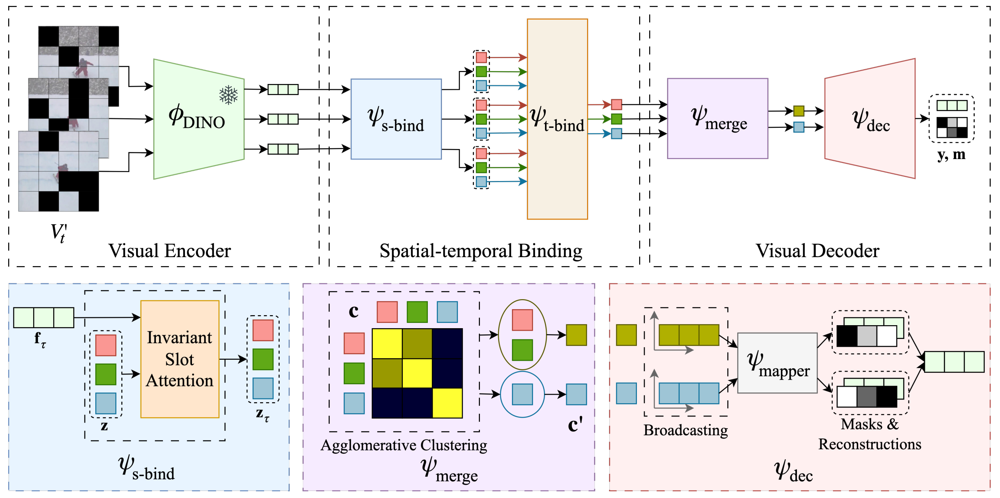

# Self-supervised Object-Centric Learning for Videos
### [Paper](https://arxiv.org/abs/2310.06907) | [Webpage](https://kuis-ai.github.io/solv)
This is the official implementation of the paper *Self-supervised Object-Centric Learning for Videos* published in NeurIPS 2023.



## Introduction

1\. Clone this repository:
```
git clone https://github.com/gorkaydemir/SOLV.git
cd SOLV
```

2\. Create a conda environment and install the dependencies:
```
conda create -n SOLV python=3.9
conda activate SOLV
conda install pytorch torchvision torchaudio pytorch-cuda=11.8 -c pytorch -c nvidia
pip install -r requirements.txt
```

3\. Install YoutubeVIS 2019 dataset to /path/to/root

## Training
```
torchrun --master_port=12345 --nproc_per_node=#gpus train.py \
--root /path/to/root \
--model_save_path /path/to/checkpoint_dir
```

## Inference
```
torchrun --master_port=12345 --nproc_per_node=1 train.py \
--root /path/to/root \
--model_save_path /path/to/checkpoint_dir \
--checkpoint_path /path/to/checkpoint_dir/checkpoint.pt --use_checkpoint --validate
```

## To-do

* [ ] Add DAVIS-17 finetuning and evaluation code


## How to Cite
```bibtex
@InProceedings{Aydemir2023NeurIPS,
    author = {Aydemir, G\"orkay and Xie, Weidi and G\"uney, Fatma},
    title = {{S}elf-supervised {O}bject-centric {L}earning for {V}ideos},
    booktitle = {Advances in Neural Information Processing Systems},
    year      = {2023}}
```

## Acknowledgments
I would like to thank [Merve Rabia Barin](https://github.com/mrabiabrn) for validating and reproducing the results using this repository.
